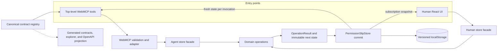
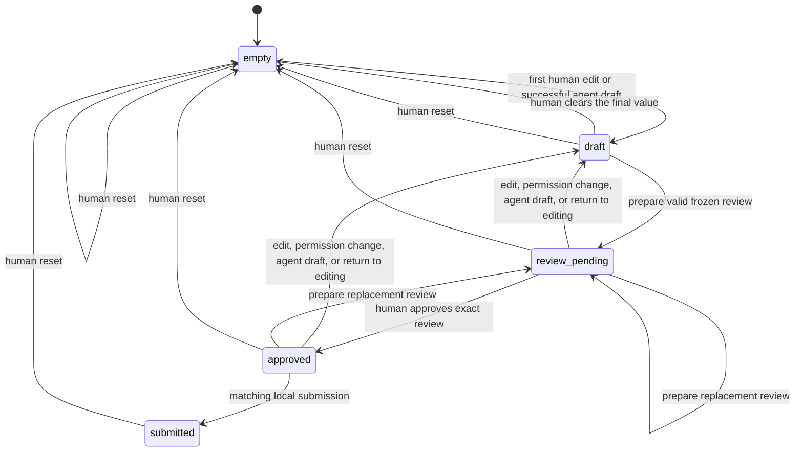
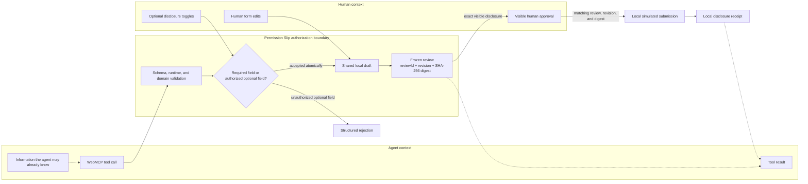

# Architecture

Permission Slip is a browser-only consent workflow. React and WebMCP are two
entry points into one domain model and one store; neither entry point owns a
parallel copy of the business rules.

There is no HTTP application API. Any generated OpenAPI document is an
**OpenAPI 3.1 documentation projection of browser-native WebMCP contracts**, not
a set of network endpoints.

## Layers and ownership

| Layer | Responsibility |
| --- | --- |
| `src/contracts` | Framework-neutral tool metadata, JSON Schemas, workflow metadata, examples, errors, and disclosure declarations. This is the source used by runtime registration and generated reference material. |
| `src/domain` | Intake types, validation, immutable state transitions, snapshot construction, canonical serialization, and digest checks. It has no React or WebMCP dependency. |
| `src/store` | Owns the current immutable state, exposes separate human and agent facades, commits domain results, persists versioned state, and synchronizes browser tabs. |
| `src/webmcp` | Projects canonical contracts into top-level `document.modelContext` registrations, validates calls, maps tool envelopes, and adapts calls to the store's agent facade. |
| `src/components` and `src/App.tsx` | Render the human workflow and invoke the store's human facade. Human-only controls live here. |
| `scripts` and `docs/generated` | Generate machine-readable contract manifests, the OpenAPI documentation projection, and developer reference material from TypeScript sources. Generated files are not independent contract sources. |

The contract layer describes what may be invoked. The domain layer remains the
authority for whether an operation is valid against the current state.

## Dependency and data flow

Domain operations return either success data plus a complete next state or a
structured error plus the state that should be retained. The store is the only
commit point. Registered tool callbacks resolve the live adapter for every call,
so they do not act on a React render or registration-time snapshot.

## Domain model

| Type | Role |
| --- | --- |
| `PermissionSlipState` | Versioned aggregate containing status, draft, provenance, revision, optional authorizations, current review/approval, receipts, and value-free activity metadata. |
| `IntakeDraft` | Editable required and optional intake values; it may be incomplete. |
| `DisclosureSnapshot` | Complete normalized required values plus only authorized, present optional values. |
| `FrozenReview` | Snapshot bound to a `reviewId`, revision, creation time, digest, and disclosed/withheld field names. |
| `HumanApproval` | Human-only record that repeats the exact review ID, revision, and digest. |
| `DisclosureReceipt` | Finalized local snapshot and disclosure metadata; it explicitly records the simulated local destination and no-network behavior. |
| `OperationResult<T>` | Success data or a structured domain error, always paired with the state the store should commit or retain. |

The agent facade can read requirements, replace a complete draft, prepare a
review, submit an already human-approved review, and read a receipt. The human
facade can edit fields, change optional disclosure permissions, prepare, approve,
return to editing, submit locally, and reset. This facade asymmetry makes
authorization and approval intentionally unavailable to tools.

## Workflow state machine

`submitted` is terminal for drafting, editing, review, approval, and submission.
Only the human reset control starts a new local demonstration. A successful edit
or disclosure-permission change clears the current review and approval and
increments the draft revision. No state transition grants approval implicitly.

## Disclosure boundary

The boundary governs what Permission Slip accepts through its WebMCP tools and
what those tools return. It does not erase information supplied in chat, prevent
an agent from inspecting the visible page, or govern processing performed by the
agent provider.

## Core invariants

1. Required fields are always part of a valid disclosure snapshot.
2. An optional value enters the snapshot only when the human has enabled its
   matching disclosure permission and the value is present and valid.
3. An agent draft containing an unknown or unauthorized optional property is
   rejected atomically.
4. A review freezes one normalized snapshot with a unique `reviewId`, current
   revision, and SHA-256 digest.
5. Only the human facade can create an approval, and it must match the current
   review's ID, revision, and digest.
6. Edits, changed permissions, replacement drafts, and returning to edit mode
   invalidate the current review and approval.
7. Submission recomputes the snapshot and digest before creating a local receipt.
8. Concurrent asynchronous review or submit work is rejected if the store state
   changes before commit.

## Persistence and concurrency

The store writes a versioned envelope to `localStorage` under the current origin.
Persisted input is parsed defensively and rejected unless its state relationships
are internally consistent. Browser storage events and a read-before-operation
synchronization step prevent another tab's newer state from being silently
overwritten. If storage is unavailable, the page continues in memory for the
current session.

This is durability for a demonstration, not a security boundary. Page scripts,
developer tools, extensions, and anyone with local browser access may alter or
erase `localStorage`.

## Contract projections and future extraction

The contract registry is plain TypeScript and JSON-compatible metadata rather
than React presentation data. That keeps open a future extraction into a package
that could project the same contracts into browser WebMCP, an MCP server, REST
gateways, AAPI, generated documentation, or bindings.

Those systems do not exist here. In particular, synthetic paths in
`docs/generated/openapi.json` are renderer-friendly documentation records. They
must carry `x-webmcp-tool: true`, `x-documentation-projection: true`, and
`x-network-endpoint: false`; clients must not attempt to call them over HTTP.
